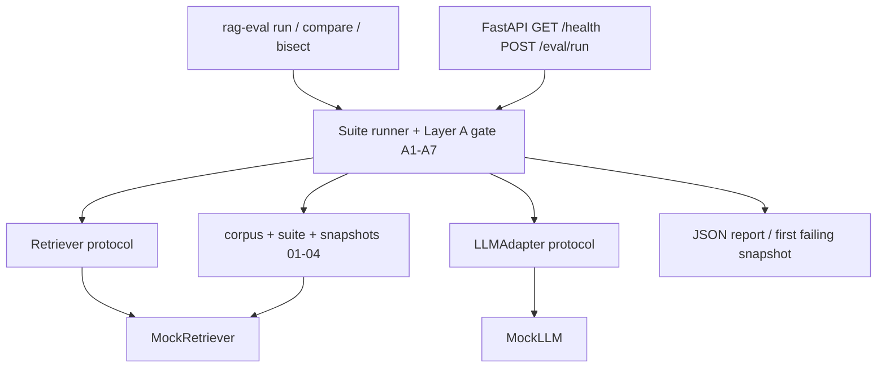
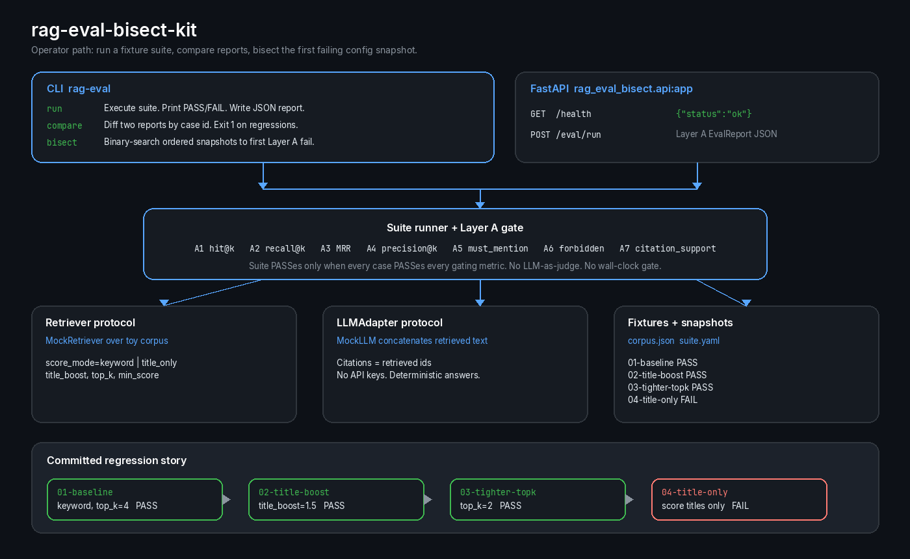
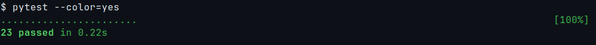
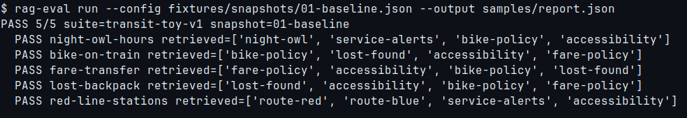
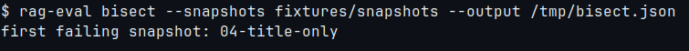
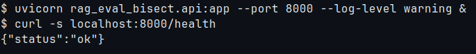

# rag-eval-bisect-kit

**Portable, CI-friendly RAG evaluation with Layer A gates and config bisect UX.**
*Deterministic retrieval checks • Report compare • Snapshot bisect • FastAPI • pytest CI*

[](https://github.com/ivanbbctba/rag-eval-bisect-kit/actions/workflows/ci.yml)
[](https://www.python.org/)
[](https://github.com/ivanbbctba/rag-eval-bisect-kit)
[](docs/adr/0001-layer-a-metric-design.md)
[](https://docs.pytest.org/)
[](https://fastapi.tiangolo.com/)
[](https://github.com/ivanbbctba/rag-eval-bisect-kit)
[](https://github.com/ivanbbctba/rag-eval-bisect-kit)

---

## The real problem

A support or logistics RAG does not usually fail as a crash. It fails as a quieter regression.

A dispatcher asks *What time does the night owl bus run?* Last week the kit retrieved **After-Hours Fleet** and the answer still mentioned `12:30`. This week, after a retrieval tweak that "should only boost titles," the same question returns **Night Notices** and **Boarding Assistance**. The gold document is gone. `must_mention` tokens disappear with it. The lost-and-found case and the fare-transfer case go with it.

The demo looks worse. Slack fills with screenshots. Nobody can name the first config change that broke the labeled cases.

That is the job this kit exists to do: turn a retrieval regression into a named snapshot, a PASS/FAIL table, and a CI gate.

This repository is an eval harness. It is not a domain RAG application and not a RAGAS clone.

## Judgment: Layer A as the only gate

The cheap, honest move is a deterministic Layer A gate plus a bisect UX.

| Choice | Why |
|--------|-----|
| Layer A only | Hit/recall, required tokens, forbidden tokens, and citation support can be computed from retrieved ids and answer text. Identical inputs produce identical PASS/FAIL. |
| No LLM-as-judge | A judge model adds cost, drift, and another failure mode. It is Layer B and out of scope for this MVP. |
| Adapter protocols | `Retriever` and `LLMAdapter` stay swappable. CI uses `MockRetriever` and `MockLLM` over a toy municipal-transit corpus. No API keys. |
| Bisect over snapshots | Ordered config files are a changelog. Binary search reports the first snapshot that fails Layer A. |
| Compare by case id | `rag-eval compare` names regressions instead of asking operators to eyeball two JSON files. |

The Layer A / Layer B split is taken from
[frontline-clinical-rag ADR-009](https://github.com/ivanbbctba/frontline-clinical-rag/blob/main/docs/adr/ADR-009.md).
This kit generalizes the determinism rule. It is not a fork of that system. There is no clinical graph and no live provider.

## Architecture overview





`pyproject.toml` exposes the console script `rag-eval = rag_eval_bisect.cli:main`.

## Quickstart

Requires Python 3.11+.

```bash
git clone https://github.com/ivanbbctba/rag-eval-bisect-kit.git
cd rag-eval-bisect-kit
python -m pip install -e ".[dev]"

rag-eval run --config fixtures/snapshots/01-baseline.json --output samples/report.json
rag-eval bisect --snapshots fixtures/snapshots --output /tmp/bisect.json
pytest
```

Expected `run` verdict on the committed baseline: `PASS 5/5`. Expected `bisect` line: `first failing snapshot: 04-title-only`. Expected `pytest`: 23 passed.



## CLI deep dive

### `rag-eval run`

Execute a fixture suite. Print a PASS/FAIL table. Write a JSON report when `--output` is set. Exit 0 only when every case PASSes every gating metric.

```bash
rag-eval run --config fixtures/snapshots/01-baseline.json --output samples/report.json
```



```text
PASS 5/5 suite=transit-toy-v1 snapshot=01-baseline
  PASS night-owl-hours retrieved=['night-owl', 'service-alerts', 'bike-policy', 'accessibility']
  PASS bike-on-train retrieved=['bike-policy', 'lost-found', 'accessibility', 'fare-policy']
  PASS fare-transfer retrieved=['fare-policy', 'accessibility', 'bike-policy', 'lost-found']
  PASS lost-backpack retrieved=['lost-found', 'accessibility', 'bike-policy', 'fare-policy']
  PASS red-line-stations retrieved=['route-red', 'route-blue', 'service-alerts', 'accessibility']
```

Title-only scoring is the committed failure:

```bash
rag-eval run --config fixtures/snapshots/04-title-only.json --output /tmp/broken.json
```

```text
FAIL 1/5 suite=transit-toy-v1 snapshot=04-title-only
  FAIL night-owl-hours retrieved=['service-alerts', 'accessibility']
  PASS bike-on-train retrieved=['accessibility', 'bike-policy']
  FAIL fare-transfer retrieved=['accessibility', 'bike-policy']
  FAIL lost-backpack retrieved=['accessibility', 'bike-policy']
  FAIL red-line-stations retrieved=['accessibility', 'bike-policy']
```

`bike-on-train` still PASSes because the gold id remains in `top_k` and `off-peak` is still in the concatenated answer. The night-owl case does not: the gold title is **After-Hours Fleet**, which does not share query tokens with *What time does the night owl bus run?*

### `rag-eval compare`

Diff two reports by case id. Exit 1 when any case flips PASS to FAIL.

```bash
rag-eval compare samples/report.json /tmp/broken.json --output /tmp/diff.json
```

```text
regressions=4 improvements=0 before=PASS after=FAIL
REGRESSION fare-transfer
REGRESSION lost-backpack
REGRESSION night-owl-hours
REGRESSION red-line-stations
```

### `rag-eval bisect`

Binary-search an ordered directory of config snapshots. With `--output`, the console prints the first-fail line and writes the probe trail to JSON.

```bash
rag-eval bisect --snapshots fixtures/snapshots --output /tmp/bisect.json
```



```text
first failing snapshot: 04-title-only
```

That is the first config that stops retrieving gold documents whose titles do not contain the query terms.

## Layer A metrics

| ID | Metric | PASS when | Default gate |
|----|--------|-----------|--------------|
| A1 | `hit_at_k` | at least one gold document id is retrieved | yes |
| A2 | `recall_at_k` | retrieved ∩ gold meets `recall_at_k_min` | yes |
| A3 | `mrr` | reciprocal rank of the first gold hit | informational unless `mrr_min > 0` |
| A4 | `precision_at_k` | fraction of retrieved ids that are gold | informational unless `precision_at_k_min > 0` |
| A5 | `must_mention` | every required substring appears in the answer | yes |
| A6 | `forbidden` | no forbidden substring appears in the answer | yes |
| A7 | `citation_support` | every cited id was actually retrieved | yes when `require_citations` |

Invariants:

1. Metric functions are pure. Same retrieved ids, gold ids, answer text, and `EvalConfig` yield the same verdict.
2. Generation is an adapter input, not a scoring model.
3. Latency and live-provider variance never flip the suite.
4. CI uses mocks. Clone and run does not need a model key.

## The 01 to 04 regression story

Committed snapshots under `fixtures/snapshots/` are a short changelog, not a notebook:

| Snapshot | Config | Layer A |
|----------|--------|---------|
| `01-baseline` | keyword overlap, `top_k=4` | PASS 5/5 |
| `02-title-boost` | same, plus `title_boost=1.5` | PASS 5/5 |
| `03-tighter-topk` | `top_k=2` | PASS 5/5 |
| `04-title-only` | `score_mode=title_only`, `top_k=2` | FAIL 1/5 |

Support scene: night-owl hours miss **After-Hours Fleet** because the title does not contain *night owl*.
Logistics scene: lost backpack and fare transfer miss **Property Desk** and **Payment Windows** for the same reason.

`bisect` names `04-title-only` instead of blaming the whole week.

## FastAPI endpoints

```bash
uvicorn rag_eval_bisect.api:app --port 8000
curl -s localhost:8000/health
```



| Method | Path | Result |
|--------|------|--------|
| `GET` | `/health` | `{"status":"ok"}` |
| `POST` | `/eval/run` | Layer A `EvalReport` JSON. Optional body: `{"config": { ... }}` |

`POST /eval/run` with `{}` runs the default toy suite. A title-only config in the body reproduces the committed FAIL.

## Sample report artifact

`samples/report.json` is a Layer A artifact from `01-baseline`. The suite header is:

```json
{
  "suite_id": "transit-toy-v1",
  "snapshot_id": "01-baseline",
  "passed": true,
  "passed_cases": 5,
  "total_cases": 5
}
```

Each case records retrieved ids, citations, answer text, and the A1-A7 metric vector. CI asserts this shape with mocks.

## Relation to frontline-clinical-rag ADR-009

[frontline-clinical-rag ADR-009](https://github.com/ivanbbctba/frontline-clinical-rag/blob/main/docs/adr/ADR-009.md)
defined Layer A as a deterministic eval gate: no LLM judge, no randomness, no wall-clock verdict.

This kit keeps that rule and drops the domain graph. It is a portable harness for any labeled retrieval suite you can express as gold ids plus string checks. Credit the ADR for the determinism split. Do not treat this repo as a clinical product or a production deployment of a domain RAG.

Local metric decisions live in
[docs/adr/0001-layer-a-metric-design.md](docs/adr/0001-layer-a-metric-design.md).

## Project layout

```text
rag-eval-bisect-kit/
├── src/rag_eval_bisect/
│   ├── cli.py          # rag-eval run / compare / bisect
│   ├── runner.py       # suite execution + Layer A verdict
│   ├── metrics.py      # A1-A7
│   ├── bisect.py       # binary search over snapshots
│   ├── compare.py      # report diffs
│   ├── adapters.py     # Retriever / LLMAdapter + mocks
│   ├── api.py          # FastAPI /health and /eval/run
│   └── models.py       # EvalConfig, fixtures, reports
├── fixtures/
│   ├── corpus.json
│   ├── suite.yaml
│   └── snapshots/      # 01-baseline ... 04-title-only
├── samples/report.json
├── docs/adr/0001-layer-a-metric-design.md
├── tests/
└── .github/workflows/ci.yml
```

## License

[GPL-3.0-or-later](LICENSE).
